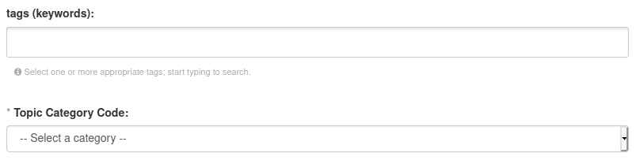

.. _data:

Data upload
==================================

Check for protocol
-------------------------------

**Warning:** Before uploading a dataset you have to be sure that the related protocol is already in the portal.
If it's not yet available, follow the instruction for :ref:`protocol upload <protocol>`

.. contents::
    :depth: 2
    :local:

Upload a dataset
-------------------------------

* Login with a user with editor role for the module the dataset belongs to
* Go to Datasets and select "Add Dataset" (if not visible, you are not authorized: contact the module leader)

.. image:: _images/addataset.png
    :align: center
    :width: 92%

Edit metadata
-------------------------------

* The first operation required to add a new dataset to the portal is editing the metadata:
* **Title (mandatory):** should be identical to the dataset name (formatted according the :ref:`formatting rules <formatting>`). It should start with a conventional prefix (starting with \V_ \ for datasets from Varanger and \S_ \ for datasets from Svalbard)
* **Module (mandatory):** Select the module related to the dataset. The user need to be editor for the module.
* **Description (mandatory):** Add a short description of the dataset. Here an example in Markdown format:

* **Tags:** Choose a list of keywords from a controlled vocabulary
* **Topic Category Code:** This is a general category for classifying data, following a commonly used standard in data repositories

* **Embargo:** Select an embargo policy. If the dataset doesn't require an embargo, go on with next point. If your dataset include data less than 2 years old, you could select an embargo end date. Read the detailed instructions on how to manage embargo data and dataset versions :ref:`here <embargo>`

* **License:** Defines which License is given to data. Defaults to CC-BY 4.0, chosen as the COAT project's license for data.

* **Contact Person (mandatory):** It is the name of the person responsible for the dataset. Coul be different from the person editing metadata. choosen from the list of registered users.
* **Email Address:** of the contact person.
* **Title of Position:** What is the professional role of the contact person?
* **Organization Name (mandatory):** Which of the COAT partner Institutions is responsible for the dataset?
* **Associated Parties:** Sometimes external institutions are involved. Not part of the Organization list above.
* **Persons:** Are there other key people related to the dataset? Ex: Field Technicians, PhD students, etc.

.. image:: _images/contacts.png
    :align: center
    :width: 92%

* **Temporal Extent:** What is the time span of the included data?

.. image:: _images/temporal.png
    :align: center
    :width: 92%

* **Geographic Location:** choose one or more locations related to the dataset collection. It is a hierarchical taxonomy of locations. From the location names bounding boxes are chosen, used also for geographical filtering of the datasets on the minimap.

.. image:: _images/location.png
    :align: center
    :width: 92%

* **Scientific Name:** One or more choices allowed. Scientific names of the species described by the datasets

.. image:: _images/scientific.png
    :align: center
    :width: 92%

* **Associated Scripts:** A link to the repository with the scripts related to the dataset.

.. image:: _images/scripts.png
    :align: center
    :width: 92%

* **Associated Study Protocol (mandatory):** This is the study protocol describing the dataset, choosen from he available ones. A study protocol needs to be added in its specific section before adding a dataset.

* **Bibliographic Citation:** TODO

* **Funding Source:** Describe the source of funding, if relevant.

.. image:: _images/funding.png
    :align: center
    :width: 92%

* After filling all metadata, select Next: "Add data"

* Upload all the data file in the following order, add a filename (best to keep the file's name by click on "Fill field with filename or URL") and choose the correct file format

.. contents::
    :depth: 2
    :local:

Data files upload order
-------------------------------

#. Upload the **readme** file as a PDF/A. A description can be added, for example: "Additional information about the dataset, including a description of the variables included in the dataset"

#. Upload the **auxiliary file/s** A description can be added, for example: "Auxiliary information about the sampling sites including information about whem the site has been included in the sampling design"

#. Upload the **coordinates** file. A description can be added, for example: "Coordinates of all sites included in the dataset"

#. Upload all **data files** in chronological order (from older to newer)

.. contents::
    :depth: 2
    :local:

Private or public datasets
-------------------------------

When a dataset is created, it defaults to "private" status.
A private dataset is not visible or accessible by unregistered or regular users.
Only logged-in users which are members or editors of the module including the dataset can see it

.. contents::
    :depth: 2
    :local:

Publishing the dataset
-------------------------------

After the upload is completed, the dataset can be set to *'Public'* by selecting **'Manage'** in the
menu of the dataset and setting the *'Visibility'* metadata element to *'Public'*.

.. contents::
    :depth: 2
    :local:

.. image:: _images/manage.png

.. image:: _images/arrow.png
    :align: center

.. image:: _images/visibility.png

Dataset Versions
-------------------------------

Datasets already published cannot be removed or modified, because of the FAIR requirement of being permanent and findable for citation and reuse purposes.
whenever a dataset content changes, it is necessary to create a new version of it.

Whenever a dataset gets created, the system automatically adds a **version prefix**: At the first dataset creation the dataset will have "_v1" added at the end of the name.
When the dataset has been published, it is possible to modify it's content only by creating a new version. To create a new version, click on the "New Version" button:

This will create a new version, which will be visible on the left bar, with buttons to switch from version to version:

.. image:: _images/versions.png

Every version of a dataset has it's own identity and **DOI**, which allows accurate dataset citation in publications at the version level.
Whenever visualizing an older version of a dataset, a friendly reminder will inform the user that it is an older version, with a link to the latest.

.. image:: _images/oldversion.png

When accessing to a dataset's main page, it will always show **the latest public version** of the dataset

.. contents::
    :depth: 2
    :local:

Updating a dataset
-------------------------------

After creating a **new version** of a dataset, which is identical to the previous version at the moment of creation,
a user should modify the dataset to add data files or modify metadata.

For both operations A user needs to click on the "Manage" button (top right) of the dataset page:

.. image:: _images/manage.png

The "manage" button will bring the user to the editing section for a dataset, defaulting to metadata editing.
If a user needs to upload new data files instead, it is enough to click on the "Resources" TAB, then "Add new resource":

.. image:: _images/updateresources.png

.. _embargo:

Embargo management
-------------------------------

Datasets in embargo follow a particular setup, which guarantees availability of older data contents and protection of more recent ones.

By default COAT data follow an Open Data policy. There is however the possibility to set an embargo for data files up to 2 years old.

**Warning:** *the embargo management is a bit complex, please read carefully the details below:*

When a dataset contains **data files** which should be kept in embargo (not reachable),
there is a specific workflow to follow, which implies the use of **dataset versions**.
It requires to create more than one version of a dataset, with the first version without an embargo, with data files reachable, and one or two versions in embargo, without data access.
Such a workflow allows visualizing the most updated metadata, and the list of files, but keeps accessible only data from the non-embargoed dataset.

A user selects the embargo end date for the versions with embargo data files.
A dataset version in embargo will keep **all the data files** inaccessible until the embargo end date, then will automatically make them available at the embargo end date.
Not authorized users will be informed that a dataset is under embargo, and need to look for a previous version (the one with non-embargoed data files)

Let's see an example...

Ola Nordmann is a data portal's editor. On January 1st 2021 he decides to upload a new dataset containing one data file per year (from 2000 to 2020).
Since he is working on a PhD thesis, he opts for keeping the latest 2 years of data in embargo (the only eligible for such exception).
No one will blame Ola Normann for this choice, even if everyone knows that keeping all the data public is the best.

Here his workflow:

* Ola creates the first dataset version, which contains only data which can be public (from year 2000 to year 2018), and calls it "sample_dataset".
* This dataset will be automatically labelled as "sample_dataset_v1".
* Ola publishes "sample_dataset_v1".
* Ola creates a new version using the "New Version" button, which will create automatically "sample_dataset_v2".
* Ola adds 1 data file containing data for the year 2019, so that "sample_dataset_v2" contains data from 2000 to 2019.
* Ola sets the embargo end date on January 1st 2022, and publishes "sample_dataset_v2".
* Ola creates a third version of the dataset, "sample_dataset_v3" including year 2020, with embargo end date January 1st 2023.
* Ola publishes also "sample_dataset_v3"
* Ola may use python or R (ckanr) scripts using his api key credentials to download even the embargo files whenever needed.
* After 1 year, "sample_dataset_v2" removes all the blocks to data access, letting available also data from year 2019, and becomes the default version of the dataset (the latest published version).
* Ola now has one more year of data, 2021, and creates a new version, including 2000 - 2021 (embargoed) with embargo end date january 1st 2023.
* And so on...

.. contents::
    :depth: 2
    :local:

