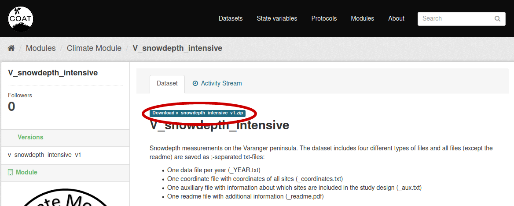
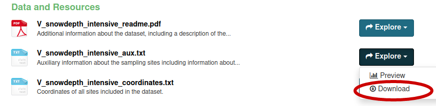
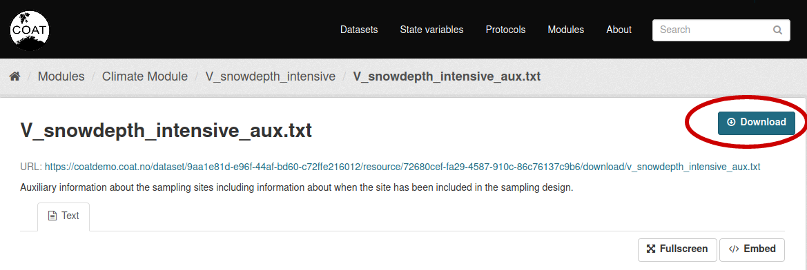

.. _download:

Data download
==================================

There are multiple options for downloading data from the COAT data portal, listed below.

Bulk download from the portal interface
------------------------------------------

To bulk download all the data belonging to ta dataset, a user can click on the button just above the dataset name.
This will create a zip package containing all data files, and spawn a download.

**Warning:** *at the moment, datasets containing many or heavy data files could result in an error during package creation.
We suggest to choose the bulk download from the API using a script (see below)*

Download single data file
------------------------------------------

To download a single data file, click on the**Explore** button on the right of a data, and then download,
from the dataset detailed view:

As an alternative, it is possible to download a file from its detailed view:

**Warning:** *After requesting a single dataset download, in case of a txt file, instead of triggering a file download the dataset could be visualised in the browser itself as a web page content:
in such a case, just press the right mouse button, and choose to download the content as txt.*

Download using the API
------------------------------------------

It is possible to download bulk data (or specific choices) using scripts interfacing to the data portal's APIs. See some examples here:

`github - data management scripts <https://github.com/COATnor/data_management_scripts>`_