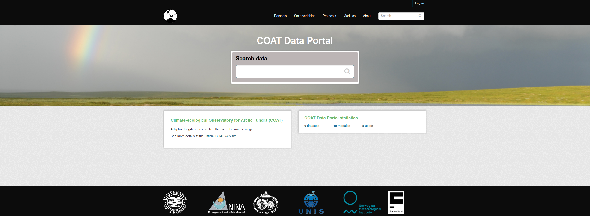

.. COAT Data Portal documentation master file, created by
   sphinx-quickstart on Wed Oct 28 09:29:28 2020.
   You can adapt this file completely to your liking, but it should at least
   contain the root `toctree` directive.

===============================================
COAT Data Management
===============================================

The `COAT Data Portal <https://data.coat.no>`_ is designed to share data collected and created following
FAIR data principles in the frame of the COAT project. For more information about the COAT project and FAIR data principles
refer to the :ref:`about section <about>`

Datasets
__________________________________________

Data in the portal is grouped in functional units called *datasets*.

In the context of the COAT data management,

a **dataset**:

* is a collection of data represented by the same set of metadata
* has a descriptive web page in the data portal
* could contain one or many data files (e.g: one per year)
* data files could be stored in different types and formats
* is identified by a DOI
* is provided a unique name and a permanent URL
* once published, is considered permanently available
* can have multiple versions
* can include additional non-data files (readme, coordinates, auxiliary)
* is formatted according to mandatory rules

For additional information about DOIs, see `datacite documentation <https://datacite.org/dois.html>`_

Types of datasets
__________________________________________

The COAT Data Portal provide a separate management for 3 types of datasets, each accessed from a different TAB of the portal:

* Collected datasets (input for State Variables)
* State Variables (Output of the project)
* Data sampling protocols (describing the study design behind data collection)

.. image:: _images/tabs.png

Modules
__________________________________________

Datasets are additionally grouped in Modules focused on the different monitoring targets of the
COAT project activities.

The modules are separated data compartments, and users need to be module editors
to be able to upload datasets to a specific module.

Modules are also a filtering category when searching for data.

.. image:: _images/modules.png

About
============================================

.. toctree::
   :maxdepth: 2

   about

Users
============================================

.. toctree::
   :maxdepth: 2

   users

Preparing data
============================================

.. toctree::
   :maxdepth: 2

   formatting

Quick check before upload
============================================

.. toctree::
   :maxdepth: 2

   check

Uploading a protocol
============================================

.. toctree::
   :maxdepth: 2

   protocol

Uploading data
============================================

.. toctree::
   :maxdepth: 2

   data

Editing metadata
============================================

.. toctree::
   :maxdepth: 2

   metadata

Indices and tables
==================

* :ref:`genindex`
* :ref:`modindex`
* :ref:`search`
