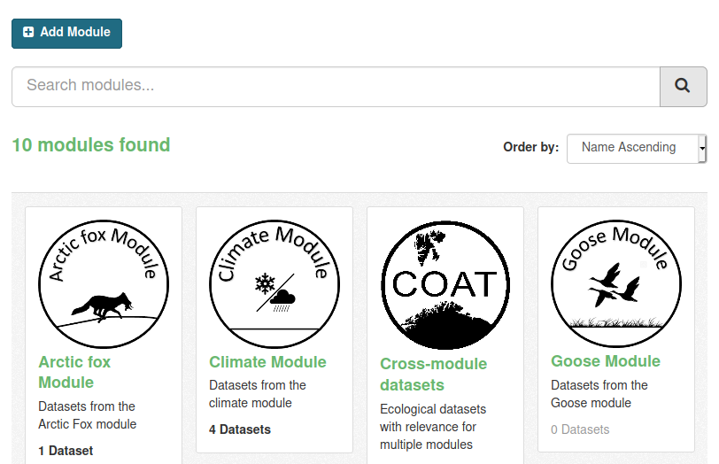

.. COAT Data Portal documentation master file, created by
   sphinx-quickstart on Wed Oct 28 09:29:28 2020.
   You can adapt this file completely to your liking, but it should at least
   contain the root `toctree` directive.

===============================================
COAT Data Management
===============================================

The `COAT Data Portal <https://data.coat.no>`_ is designed to share data collected and created following
FAIR data principles in the frame of the Climate-ecological Observatory for Arctic Tundra (COAT). For more information about COAT and FAIR data principles
refer to the :ref:`about section <about>`

.. image:: _images/dataportal_homepage_screenshot.png

Datasets
__________________________________________

Data in the COAT data portal is grouped in units called *datasets*.

In the context of the COAT data management,

a **dataset**:

* is a collection of data represented by the same set of metadata
* has a descriptive web page in the data portal
* could contain one or many data files (e.g: one per year)
* data files could be stored in different types and formats
* is identified by a DOI
* is provided a unique name and a permanent URL
* once published, is considered permanently available
* can have multiple versions
* can include additional non-data files (readme, coordinates, auxiliary)
* is formatted according to a specific set of guidelines

*For additional information about DOIs, see* `datacite documentation <https://datacite.org/dois.html>`_

Types of datasets
__________________________________________

The COAT Data Portal has 3 types of datasets, each accessed from a different TAB of the portal:

* Collected **datasets** (input for State Variables, raw data compliant to COAT formats)
* **State Variables** (Derived datasets for assessing state of COAT monitoring targets)
* Data sampling **protocols** (describing the study design behind data collection)

.. image:: _images/tabs.png

Modules
__________________________________________

Datasets are additionally grouped in Modules, according to the food web module structure of COAT.

The modules are separated data compartments, and users need to be module editors
to be able to upload datasets to a specific module.

Modules are also a filtering category when searching for data.

Before uploading datasets
__________________________________________

To be ready for data upload, dataset files need to be formatted according to mandatory formatting rules.
Find more details in the :ref:`data formatting section <formatting>`

Before uploading a dataset a user needs to check that the corresponding protocol is already uploaded in the system.
If not yet available, the first operation is to upload a protocol. See more details in the :ref:`protocol uploading section <protocol>`

To help performing all the required steps before data upload, the :ref:`quick check section <check>` helps to make sure that everything is ready for upload.

Uploading datasets
__________________________________________

When the data files are formatted and ready, the data upload process can start:

* A user authorized to add data to a module can create a new dataset
* the user edits the metadata using a form in the data portal interface
* then can add all the data files, following a specific order.
* data files can be added manually using the Graphic Interface, or by command line or scripting using the data API.

More details in the :ref:`data upload section <data>`

During upload procedures the dataset will be still in private mode. Once the dataset is uploaded it can be published.
Publishing means creating a DOI for the dataset. This means making the dataset permanent,
with the obligation of being always available, findable and accessible. If any modification needed,
it will be solved by creating a new version of the dataset.

Datatasets can be set in an embargo mode, to keep private the most recent data files (up to 2 years).
See details in the :ref:`embargo description <embargo>`

Uploading data to existing dataset
__________________________________________

New data can be added to an existing dataset, for example to add one more year of monitoring data.
To upload new data to an existing dataset, a user needs to create a new version of an existing dataset. 

More details in the "Updating dataset" section of :ref:`data upload section <updating>`

About
============================================

.. toctree::
   :maxdepth: 2

   about

Users
============================================

.. toctree::
   :maxdepth: 2

   users

Preparing data
============================================

.. toctree::
   :maxdepth: 2

   formatting

Quick check before upload
============================================

.. toctree::
   :maxdepth: 2

   check

Uploading a protocol
============================================

.. toctree::
   :maxdepth: 2

   protocol

Uploading data
============================================

.. toctree::
   :maxdepth: 2

   data

Downloading data
============================================

.. toctree::
   :maxdepth: 2

   download

