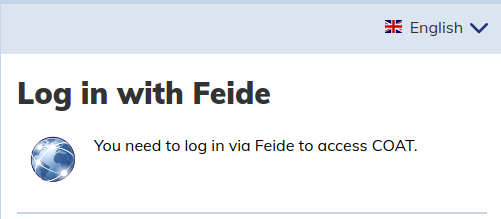
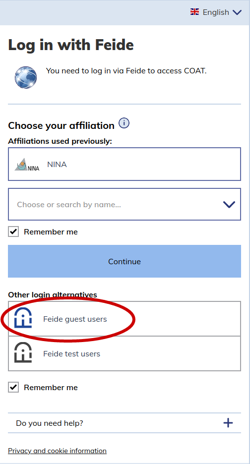
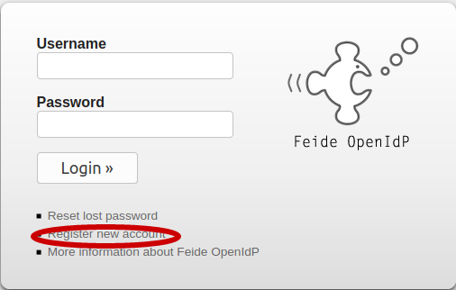

.. _users:

User types
==================================

COAT researchers and data managers can login to the Data Portal using their FEIDE account. 
External users cannot log into the data portal, and can only see those parts of public datasets that are not behind embargo.
There are different roles which can be assigned to COAT users

* regular users
* members of a module
* editors of a module
* administrators

To be registered in the Data Portal, users need to login once.
After the first login, users can be added to modules (by administrators or module editors).

Login with Feide
-----------------------------------------

To create a user in the Data Portal you need to login fo the first time using FEIDE. [Eeva: add info what to do when one does not have Feide, this is the case for e.g. NPI]

If your institution is not available in Feide, you have to login using a Feide guest account:

And create an OpnIdP account:

Regular Users
-------------------------------------------

Regular users are users who logged in to the system at least once. 
A regular user is listed as a possible choice in the metadata dropdown list for selecting the owner of a dataset.
A regular user can be upgraded to member or editor of one or more modules. 
A regular user has no authorizations in the Data Portal,
and can visualize the same things that a not-logged in user can:

* See public datasets and resources, even if under embargo
* Can't see private datasets
* Can't create new datasets

Members of a Module
-------------------------------------------

A user can be member of multiple Modules

Members of a Module:

* Can't create new datasets
* Can see private datasets of a Module

Editors of a Module
-------------------------------------------

A user can be editor of multiple Modules

Editors of a Module:

* Can add members to a Module
* Can create datasets for a specific Module
* Can visualize private datasets of a Module

Administrators
-------------------------------------------

They have superpowers
